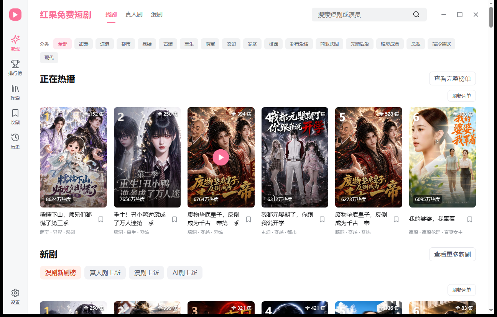

# 红果短剧电脑版（非官方 Windows 桌面版）

在 Windows 电脑上找剧、接着上次看。支持搜索、收藏、本机观看进度、选集、倍速和自动连播。

**免费个人项目 · 非官方 · 当前公开版本 1.0.2**

**[下载 Windows 安装程序](https://github.com/waligoraamodio288-rgb/hongguo-desktop-releases/releases/download/v1.0.2/hongguo-1.0.2-windows-x86_64-setup.exe)**　｜　[三步安装](#三步开始使用)　｜　[下载与安装说明](#下载与安装说明)　｜　[全部版本](https://github.com/waligoraamodio288-rgb/hongguo-desktop-releases/releases)

Windows 10 / 11 **x64（64 位）** · 安装包 **102.8 MiB**。普通使用只需下载 `.exe`，不需要下载源码 ZIP、`.sig` 或 `latest.json`。

## 软件界面



*1.0.2 正式安装包在隔离 Windows 环境中实拍的首页；图中剧目封面来自内容服务，具体内容和播放可用性以实际环境为准。*

第三方收录：[不死鸟 2026 年 9 月 23 日每日分享](https://iui.su/213/)。该条目链接到本项目的原版 1.0.2 发行页。

## 三步开始使用

1. 通过上方链接下载 `hongguo-1.0.2-windows-x86_64-setup.exe`。
2. 按安装程序完成安装。已有可用 WebView2 时会复用，缺失时安装程序需联网补齐。如果进度条接近终点但仍显示执行 `guoban-webview2-setup.exe`，安装程序正在等待运行环境补装结束，请先不要关闭窗口或重复运行安装包。若在线补装失败、启动提示缺少 WebView2，或已知网络不稳定，可到[微软官方 WebView2 Runtime 下载页](https://developer.microsoft.com/en-us/microsoft-edge/webview2/)选择 **Evergreen Standalone Installer（x64）** 安装，再重试红果安装或启动。若安装进度长时间没有变化，请记录界面和发生时间后反馈。
3. 打开应用，浏览分类或搜索剧名，进入详情后播放。观看进度保存在桌面端，不代表同步手机红果 App 账号和历史。

如果详情页提示“桌面内容服务尚未就绪”，播放按钮此时不可点击。可先等待约 1 分钟，再到“设置”→“播放服务”点“检查连接”；若仍显示“未连接”，请在[播放问题 #5](https://github.com/waligoraamodio288-rgb/hongguo-desktop-releases/issues/5)补充检查结果和提示原文。若已进入播放器却没有画面，再说明加载、黑屏或报错情况。没有 GitHub 账号可发邮件至[项目邮箱](mailto:WaligoraAmodio288@gmail.com)。目前原因尚未确认。

老板键可以在设置里配置，用于隐藏和恢复窗口；**不会自动暂停或静音**。

## 当前已知反馈

| 问题 | 1.0.2 状态与处理 |
| --- | --- |
| 默认播放清晰度 | 1.0.2 优先选择可识别的较高分辨率片源，避免仅按文件大小选择；实际清晰度取决于内容提供的片源，未新增手动画质切换。 |
| [切换下一集后倍速失效 #3](https://github.com/waligoraamodio288-rgb/hongguo-desktop-releases/issues/3) | 1.0.1 已修复切换剧集后实际倍速可能恢复为 1 倍的问题。若更新后仍有问题，请补充系统、版本和步骤。 |
| [跨设备同步观看记录 #4](https://github.com/waligoraamodio288-rgb/hongguo-desktop-releases/issues/4) | 1.0.2 的观看记录和收藏仅保存在当前电脑，尚不支持两台电脑或电脑与手机之间同步。已向提出者询问具体使用场景，暂无上线时间。 |
| [弹幕功能建议 #2](https://github.com/waligoraamodio288-rgb/hongguo-desktop-releases/issues/2) | 已记录需求，暂未承诺支持或上线时间。 |
| [进度条显隐与外部播放器 #1](https://github.com/waligoraamodio288-rgb/hongguo-desktop-releases/issues/1) | 原 Issue 已关闭；关闭记录没有关联修复提交，不能据此认定所有现象已经解决。相同问题可新建报告并附复现步骤。 |

## 使用反馈

- 遇到故障：[提交问题](https://github.com/waligoraamodio288-rgb/hongguo-desktop-releases/issues/new?template=bug-report.yml)。请说明系统、软件版本、操作步骤、预期和实际结果。
- 有功能想法：[提出建议](https://github.com/waligoraamodio288-rgb/hongguo-desktop-releases/issues/new?template=feature-request.yml)。先描述使用场景，方便判断改进方向。
- 不使用 GitHub 也可发邮件：[WaligoraAmodio288@gmail.com](mailto:WaligoraAmodio288@gmail.com)。如果愿意，也请说明在哪里看到本软件、是否成功播放或再次使用。

来源可以不填。请不要公开账号凭证、令牌、私人观看记录，截图时遮住无关个人信息。

## 下载与安装说明

当前版本尚未配置 Windows 发布者代码签名，系统可能显示未知发布者或 SmartScreen 提示。请核对下载来源与文件，不要关闭系统防护；某些系统策略可能限制安装。

安装器大小：`107743692` 字节。SHA-256：

```text
437065b3e97a5536aabacb92d1564fe686029cf5cbf8e7783769fea26bd68da9
```

摘要用于核对文件一致性，不能代替发布者身份认证。应用内更新使用固定公钥验证更新包签名；更新签名与 Windows 发布者代码签名不同。软件启动后可以检查版本，也可在设置中手动检查，仅在用户点击更新后下载安装。

[1.0.2 版本说明与附件](https://github.com/waligoraamodio288-rgb/hongguo-desktop-releases/releases/tag/v1.0.2) · [全部版本](https://github.com/waligoraamodio288-rgb/hongguo-desktop-releases/releases)

## 关于本仓库

这是**公开发行与反馈仓库**，不包含私有应用源码或签名私钥，不代表应用源码已开源。每个版本保留安装器、更新签名、`latest.json`、摘要文件及本版本所需第三方对应源码附件；第三方许可、来源和声明也保留在安装目录 `backend/licenses`。

由渠道有数维护。与红果短剧及其运营方无官方合作关系；相关品牌与内容归各自权利方所有，内容和播放可用性受来源及网络情况影响。
